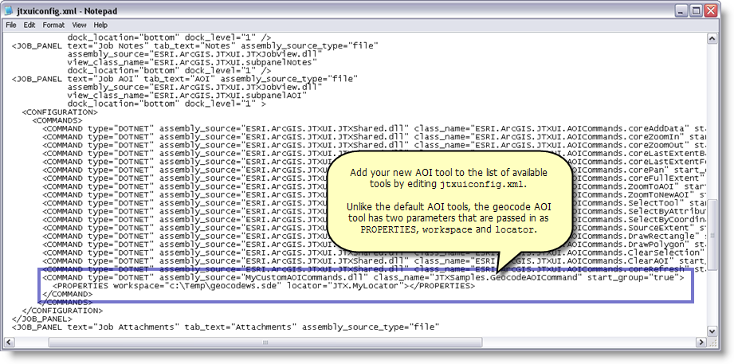

Adding a custom AOI command

* * *

This sample shows how to extend the ArcGIS Workflow Manager client application with your own AOI definition tool. <spaces> </spaces>In the sample, you will add an address finder tool to the available commands on the job's AOI tool.

<table x-use-null-cells="" style="x-cell-content-align: top; width: 50%; border-spacing: 0px; border-spacing: 0px;" cellspacing="0" width="50%"><colgroup><col style="width: 50%;"> <col style="width: 50%;"></colgroup>

<tbody>

<tr style="x-cell-content-align: top;" valign="top">

<td style="width: 50%; padding-right: 10px; padding-bottom: 4px; padding-top: 4px;
	padding-left: 10px; background-color: #c0c0c0; border-top-style: Solid;
	border-bottom-color: #808080; border-bottom-width: 1px; border-bottom-style: Solid;
	border-right-color: #808080; border-right-width: 1px; border-right-style: Solid;
	border-left-color: #808080; border-left-width: 1px; border-left-style: Solid;
	border-top-color: #808080; border-top-width: 1px;" bgcolor="#C0C0C0" width="50%">

Development licensing

</td>

<td style="width: 50%; padding-right: 10px; padding-left: 10px; padding-bottom: 3px;
	padding-top: 3px; background-color: #c0c0c0; border-top-style: Solid;
	border-bottom-color: #808080; border-bottom-width: 1px; border-bottom-style: Solid;
	border-top-color: #808080; border-top-width: 1px; border-right-color: #808080;
	border-right-width: 1px; border-right-style: Solid;" bgcolor="#C0C0C0" width="50%">

Deployment licensing

</td>

</tr>

<tr style="x-cell-content-align: top;" valign="top">

<td style="width: 50%; padding-right: 10px; padding-left: 10px; padding-bottom: 3px;
	padding-top: 3px; border-bottom-color: #808080; border-bottom-width: 1px;
	border-bottom-style: Solid; border-right-color: #808080; border-right-width: 1px;
	border-right-style: Solid; border-left-color: #808080; border-left-width: 1px;
	border-left-style: Solid;" width="50%">

ArcEditor: JTX

</td>

<td style="width: 50%; padding-right: 10px; padding-left: 10px; padding-bottom: 3px;
	padding-top: 3px; border-bottom-color: #808080; border-bottom-width: 1px;
	border-bottom-style: Solid; border-right-color: #808080; border-right-width: 1px;
	border-right-style: Solid;" width="50%">

ArcEditor: JTX

</td>

</tr>

<tr style="x-cell-content-align: top;" valign="top">

<td style="width: 50%; padding-right: 10px; padding-left: 10px; padding-bottom: 3px;
	padding-top: 3px; border-bottom-style: Solid; border-right-color: #808080;
	border-right-width: 1px; border-right-style: Solid; border-left-color: #808080;
	border-left-width: 1px; border-left-style: Solid; border-bottom-color: #808080;
	border-bottom-width: 1px;" width="50%">

ArcInfo: JTX

</td>

<td style="width: 50%; padding-right: 10px; padding-left: 10px; padding-bottom: 3px;
	padding-top: 3px; border-bottom-style: Solid; border-bottom-color: #808080;
	border-bottom-width: 1px; border-right-color: #808080; border-right-width: 1px;
	border-right-style: Solid;" width="50%">

ArcInfo: JTX

</td>

</tr>

</tbody>

</table>

Additional Requirements

*   This tool uses an Address Locator stored in an SDE geodatabase.

How to use

1.  Open the solution using Visual Studio.

2.  Verify the references are still intact. It may be necessary to configure the JTXUI reference again.

3.  Compile the sample project.

Showing the new command in the ArcGIS Workflow Manager Application

1.  Copy the compiled .dll from bin\debug\MyCustomAOICommands.dll to Workflow Manager Install Location\Bin.

2.  Edit Workflow Manager Install Location\config\jtxuiconfig.xml in a text editor or editor of your choice.

3.  Scroll till you find the <VIEWS> section and locate the start of the <JOB PANELS>. <spaces> </spaces>Look for the JOB_AOI job panel.

4.  Within the command list, add an entry for your new command.

5.  This command has two parameters, one for the location of the .sde file pointing to the database that contains the address locator and one for the name of the address locator. <spaces> </spaces>

6.  Save your changes. 

 <implicit_p>

Using the new command

1.  Open the ArcGIS Workflow Manager client application.

2.  Select a job.

3.  Click the AOI tab. <spaces> </spaces>Your new command should appear at the end of the end of the toolbar.

4.  Click the command. <spaces> </spaces>An address finder dialog appears.

5.  Enter an address you'd like to find with your locator.

6.  Click OK.

7.  You are zoomed to the area of the address you entered and a draft AOI polygon is drawn on the map.

8.  Click to save the AOI polygon drawn or draw a new one.

     <implicit_p> </implicit_p></implicit_p>
