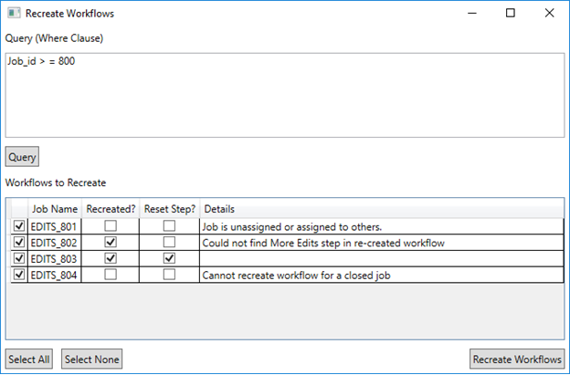
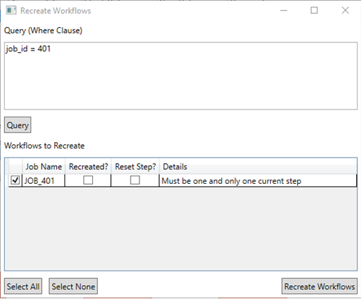

Recreate Workflow and preserve current step

* * *

This sample demonstrates recreating workflows and preserving the current step in the job. 

<table x-use-null-cells="" style="x-cell-content-align: top; border-spacing: 0px; width: 50%; border-spacing: 0px;" cellspacing="0" width="50%"><colgroup><col style="width: 50%;"> <col style="width: 50%;"></colgroup>

<tbody>

<tr style="x-cell-content-align: top;" valign="top">

<td style="width: 50%; padding-right: 10px; padding-bottom: 4px; padding-top: 4px;
	padding-left: 10px; background-color: #c0c0c0; border-top-style: Solid;
	border-bottom-color: #808080; border-bottom-width: 1px; border-bottom-style: Solid;
	border-right-color: #808080; border-right-width: 1px; border-right-style: Solid;
	border-left-color: #808080; border-left-width: 1px; border-left-style: Solid;
	border-top-color: #808080; border-top-width: 1px;" bgcolor="#C0C0C0" width="50%">

Development licensing

</td>

<td style="width: 50%; padding-right: 10px; padding-left: 10px; padding-bottom: 3px;
	padding-top: 3px; background-color: #c0c0c0; border-top-style: Solid;
	border-bottom-color: #808080; border-bottom-width: 1px; border-bottom-style: Solid;
	border-top-color: #808080; border-top-width: 1px; border-right-color: #808080;
	border-right-width: 1px; border-right-style: Solid;" bgcolor="#C0C0C0" width="50%">

Deployment licensing

</td>

</tr>

<tr style="x-cell-content-align: top;" valign="top">

<td style="width: 50%; padding-right: 10px; padding-left: 10px; padding-bottom: 3px;
	padding-top: 3px; border-bottom-color: #808080; border-bottom-width: 1px;
	border-bottom-style: Solid; border-right-color: #808080; border-right-width: 1px;
	border-right-style: Solid; border-left-color: #808080; border-left-width: 1px;
	border-left-style: Solid;" width="50%">

ArcEditor: JTX

</td>

<td style="width: 50%; padding-right: 10px; padding-left: 10px; padding-bottom: 3px;
	padding-top: 3px; border-bottom-color: #808080; border-bottom-width: 1px;
	border-bottom-style: Solid; border-right-color: #808080; border-right-width: 1px;
	border-right-style: Solid;" width="50%">

ArcEditor: JTX

</td>

</tr>

<tr style="x-cell-content-align: top;" valign="top">

<td style="width: 50%; padding-right: 10px; padding-left: 10px; padding-bottom: 3px;
	padding-top: 3px; border-bottom-style: Solid; border-right-color: #808080;
	border-right-width: 1px; border-right-style: Solid; border-left-color: #808080;
	border-left-width: 1px; border-left-style: Solid; border-bottom-color: #808080;
	border-bottom-width: 1px;" width="50%">

ArcInfo: JTX

</td>

<td style="width: 50%; padding-right: 10px; padding-left: 10px; padding-bottom: 3px;
	padding-top: 3px; border-bottom-style: Solid; border-bottom-color: #808080;
	border-bottom-width: 1px; border-right-color: #808080; border-right-width: 1px;
	border-right-style: Solid;" width="50%">

ArcInfo: JTX

</td>

</tr>

</tbody>

</table>

How to use

1.  Open the solution using Visual Studio.

2.  Verify the references are still intact. It may be necessary to configure the references again.

3.  Compile the sample project to create the RecreateWorkflowWPF executable.

Recreating the workflows using the dialog

1.  Once the project has been compiled, open the executable.

2.  Define a where clause to query the jobs whose workflow you want to recreate.

3.  The jobs from the default database matching the query are returned in the list.

4.  Select the job from the list to recreate the workflow.
	

Additional information

*	The column Recreated? indicates whether the workflow was recreated by a check mark. If the workflow is not recreated the check mark is not displayed for the job. The workflow will not be recreated for a job in the following scenarios:

    *	Job is not assigned to the current user

	*	Job is closed

*	The column Reset Step? indicates whether the current step of the previous workflow is preserved and reset as the current step in the recreated workflow, by a check mark. If the step is not reset the check mark is not displayed for the job. When the step cannot be reset, the first step in the workflow is set as the current step. The step will not be reset for a job in the following scenarios:

	*	if the step has been deleted or renamed in the workflow before it is recreated for the job. 

	*	If more than one step has same name in the new workflow

*   The sample will not recreate the workflow and reset the step if there is more than on current step in the job. The details will display a message for this as well.
	

*	If the sample fails to recreate the workflow or reset the step the reason is displayed in the details column

*   The sample also logs information in the history when workflow is recreated and step is set as current step. 
	