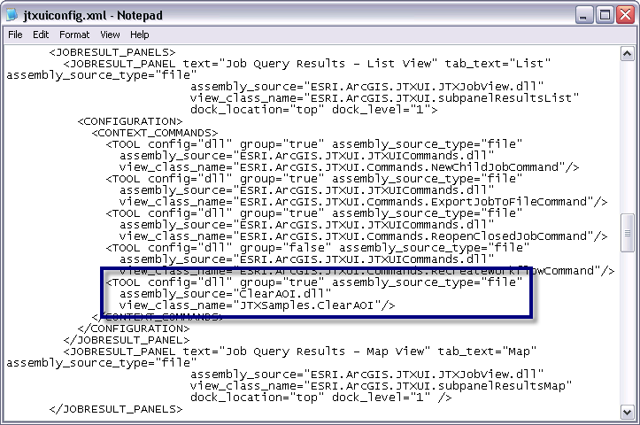

Adding a context menu item

* * *

This sample shows how to extend the ArcGIS Workflow Manager client application with your job results list context menu item. <spaces> </spaces>In the sample, you will add a menu item to remove the area of interest from all selected jobs.

<colgroup><col style="width: 50%;"> <col style="width: 50%;"></colgroup>
| 

Development licensing

 | 

Deployment licensing

 |
| 

ArcEditor: JTX

 | 

ArcEditor: JTX

 |
| 

ArcInfo: JTX

 | 

ArcInfo: JTX

 |

How to use

1.  Open the solution using Visual Studio.

2.  Verify the references are still intact. It may be necessary to configure the JTXUI reference again.

3.  Compile the sample project.

Showing the new tab in the ArcGIS Workflow Manager Application

1.  Copy the compiled .dll from bin\debug\ClearAOI.dll to Workflow Manager Install Location\Bin.

2.  Edit Workflow Manager Install Location\config\jtxuiconfig.xml in a text editor or editor of your choice.

3.  Scroll till you find the <JOBRESULT_PANELS> section and locate the start of the <CONTEXT_COMMANDS>.

4.  Add a new entry for your context menu item. <spaces> </spaces>Then end result will look something like the following:

 <implicit_p>

Additional information

The end result, is that you have a new context menu item in the client application...

<implicit_p></implicit_p></implicit_p>
