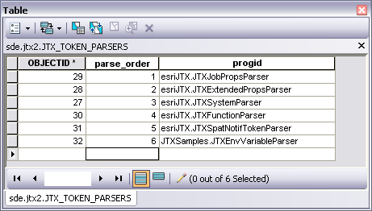

Adding a custom Token Parser

* * *

This sample shows how to extend the ArcGIS Workflow Manager client application with your own token parser. This token parser will allow you to use tokens to retrieve Windows environment variables.

<table x-use-null-cells="" style="x-cell-content-align: top; width: 50%; border-spacing: 0px; border-spacing: 0px;" cellspacing="0" width="50%"><colgroup><col style="width: 50%;"> <col style="width: 50%;"></colgroup>

<tbody>

<tr style="x-cell-content-align: top;" valign="top">

<td style="width: 50%; padding-right: 10px; padding-bottom: 4px; padding-top: 4px;
	padding-left: 10px; background-color: #c0c0c0; border-top-style: Solid;
	border-bottom-color: #808080; border-bottom-width: 1px; border-bottom-style: Solid;
	border-right-color: #808080; border-right-width: 1px; border-right-style: Solid;
	border-left-color: #808080; border-left-width: 1px; border-left-style: Solid;
	border-top-color: #808080; border-top-width: 1px;" bgcolor="#C0C0C0" width="50%">

Development licensing

</td>

<td style="width: 50%; padding-right: 10px; padding-left: 10px; padding-bottom: 3px;
	padding-top: 3px; background-color: #c0c0c0; border-top-style: Solid;
	border-bottom-color: #808080; border-bottom-width: 1px; border-bottom-style: Solid;
	border-top-color: #808080; border-top-width: 1px; border-right-color: #808080;
	border-right-width: 1px; border-right-style: Solid;" bgcolor="#C0C0C0" width="50%">

Deployment licensing

</td>

</tr>

<tr style="x-cell-content-align: top;" valign="top">

<td style="width: 50%; padding-right: 10px; padding-left: 10px; padding-bottom: 3px;
	padding-top: 3px; border-bottom-color: #808080; border-bottom-width: 1px;
	border-bottom-style: Solid; border-right-color: #808080; border-right-width: 1px;
	border-right-style: Solid; border-left-color: #808080; border-left-width: 1px;
	border-left-style: Solid;" width="50%">

ArcEditor: JTX

</td>

<td style="width: 50%; padding-right: 10px; padding-left: 10px; padding-bottom: 3px;
	padding-top: 3px; border-bottom-color: #808080; border-bottom-width: 1px;
	border-bottom-style: Solid; border-right-color: #808080; border-right-width: 1px;
	border-right-style: Solid;" width="50%">

ArcEditor: JTX

</td>

</tr>

<tr style="x-cell-content-align: top;" valign="top">

<td style="width: 50%; padding-right: 10px; padding-left: 10px; padding-bottom: 3px;
	padding-top: 3px; border-bottom-style: Solid; border-right-color: #808080;
	border-right-width: 1px; border-right-style: Solid; border-left-color: #808080;
	border-left-width: 1px; border-left-style: Solid; border-bottom-color: #808080;
	border-bottom-width: 1px;" width="50%">

ArcInfo: JTX

</td>

<td style="width: 50%; padding-right: 10px; padding-left: 10px; padding-bottom: 3px;
	padding-top: 3px; border-bottom-style: Solid; border-bottom-color: #808080;
	border-bottom-width: 1px; border-right-color: #808080; border-right-width: 1px;
	border-right-style: Solid;" width="50%">

ArcInfo: JTX

</td>

</tr>

</tbody>

</table>

How to use

1.  Open the solution using Visual Studio.

2.  Verify the references are still intact.

3.  Compile the sample project.

4.  Add the token parser to the JTX_TOKEN_PARSERS table. This can be done using ArcMap. The record should include the order the token parser should be applied it, and the progID of the parser. For example:

    

5.  Copy the compiled .dll from bin\debug\JTXEnvVariableParser.dll to Workflow Manager Install Location\Bin.
