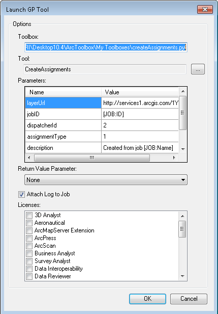
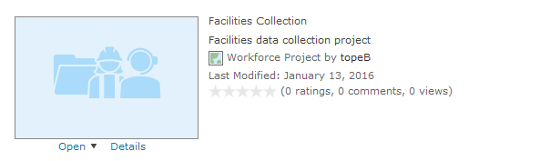
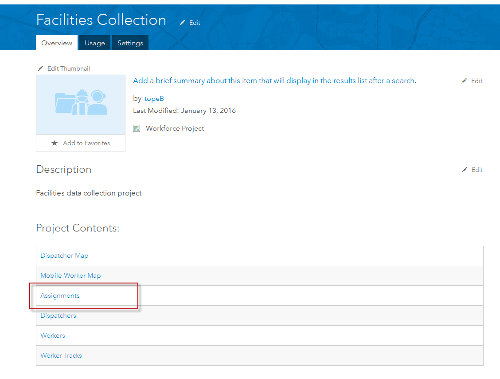

WorkflowManager-Workforce
=========================

This sample allows for the creation of Workforce for ArcGIS assignments from
ArcGIS Workflow Manager.

Generally, this sample should be configured to be run as a geoprocessing step
in a Workflow Manager workflow using either the LaunchGPTool or ExecuteGPTool
custom step types.

The Assignment Location will be based on the Location of Interest (LOI) of the job.
If the job contains an Area of Interest, the Assignment Location will be based
on the centroid of the area. Multipart Locations of Interest will result in an
Assignment created for each part. If no LOI is defined for the job, an error will be
displayed as the location is a required component of an Assignment.

Deployment
----------

1. Download the python toolbox and save it locally
2. Configure the Workflow Manager step arguments

    

    1. Select the toolbox and tool from where you saved it in step 1
    2. **layerURL** - Configure to point to the Assignments feature service used by Workforce
        - Search for the item within your Organization and open it

        

        - Select the Assignments sub-item

        

        - Right-click the Service URL link and copy the link location

        

    3. **jobID** - This should generally be the [Job:ID] token.
    It is used to populate the Work Order field in the created Assignment.
    4. **dispatcherId** - This is the ID of the dispatcher that the Assignments
    will be created as. This can be found from the Dispatchers sub-item of the
    Workforce project item. You will have to manually display OBJECT ID field
    
    5. **assignmentId** - This is the ID of the Assignment Type from Workforce
    6. **description** - This is used to populate the description of the newly
    created Assignment.
    7. **jtcPath** - This can be used to override the Workflow Manager connection to use.
    Advanced usage only
    8. **objectIds** - This is an output parameter populated with the Object IDs
    of the newly created assignments. Advanced usage only

See Also:
---------

- [Workforce](http://workforce.arcgis.com)
- [Workflow Manager](http://esri.com/workflowmanager)

